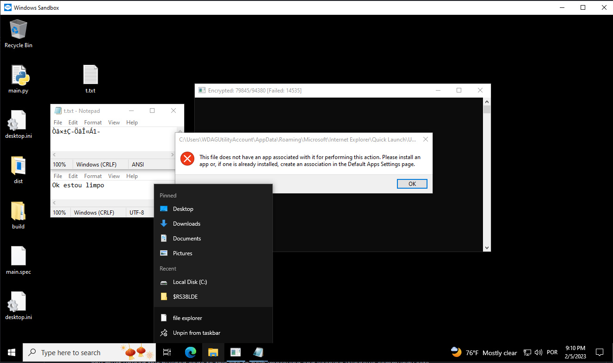

# PyCrypt
Simple AV(AntiVirus) tester written in python.  

` You should install pyinstaller and convert the main.py to an .EXE `  
Follow this steps:  
  - `pip install pyinstaller`  
  - `pyinstaller --onefile --icon NONE .\main.py`   
    
It should generate few files/folders.   
The .EXE will be on .\dist\  
***Note that .\ means the active/current dir of the cmd***  
  
An exemplar of this script, builded with pyinstaller has been [uploaded](https://www.virustotal.com/gui/file/7dff8f3b19fdd68452e17538fc1e6109be061e527dd897a5338cb4fa800f13aa) to [VirusTotal](https://www.virustotal.com/) to enhance the detection of this script behaviours! 
[VirusTotal](https://www.virustotal.com/) is a tool to scan files and urls agains harmfull files. It shares data bases among others companys to increase the detection.  
You must upload this builded code to this site to help improving and keeping Windows community safe. 
    
# Preview
      
      
## DISCLAIMER/FATAL  
The following script is for research purposes only and is not intended for any commercial or illegal use. The user assumes all responsibility for any actions or consequences resulting from the use of this script. The author of this script shall not be held responsible for any damage or harm that may arise from the use of this script, including but not limited to harm to personal data or damage to critical Windows files.

This script should not be run outside of a virtual machine or sandbox environment, as it may cause fatal damage to your system. The user is solely responsible for ensuring that the use of this script complies with all applicable laws and regulations and for implementing proper precautions and safety measures, such as using a virtual machine or sandbox, before running the script. This script is provided "as is" without any warranties or guarantees, express or implied.
